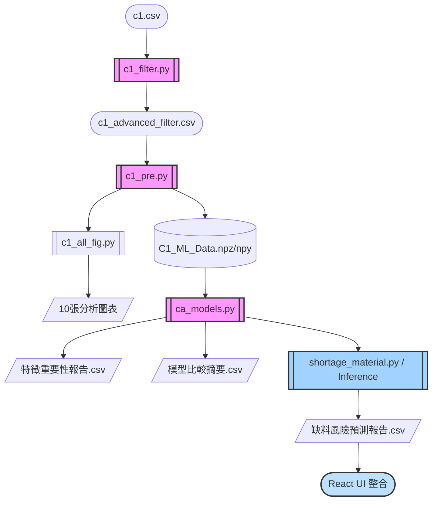

# C1 專題

## 使用方法

### 1. 工作流

-------

cd c:\local_file\專題

python auto.py                      # 從EPR中依據ERP_Table_Name.xlsx抓取資料到 ERP_Table.xlsx

-------

cd c:\local_file\專題\c1

python c1_PURT.py                   # 從ERP_Table.xlsx中抓PURT檔作為c1物料分析的資料

python c1_filter.py                 # 過濾清洗PURT.csv 的資料

python c1_pre.py                    # model資料前處理    # PT λ leak,

python c1_models.py                 # 訓練model，生成baseline等。

-------

cd c:\local_file\專題\model

python material_storage_table.py    # 生成'製程與所需物料庫存表.csv' 與 'Model缺料物料.csv'

python pre_material.py              # 做前處理以丟給model

python model_predict.py             # 預測模型

python all_table.py                 # 把預測後的結果與整張製程合併在一起，為最終建立db的資料檔"製令總表.csv"

### TODO

------------------------------------------------------------------------------------

物料單號 (點開來) | 庫存數量 | 目前需買數量(庫存-所需+叫料單)                          |(製令總表-材料品號,材料品名,材料規格,庫存數量)

   |------------------------------------------------                               |

   |製程 | 所需用量 | 累計量 | 預計開工日 | 實際開工日 | 預計到貨日 |                  |(製令總表-製令單號,預計開工日,產品品名,預計用料,風險評估,預測進貨日期)(先以一個月為分界線採購)

   |---                                                                            |

   |叫料單 | 到料量 | 預測到料時間 |                                                 |(叫料單-採購單別,採購單號,預計到貨日期,庫存數量)

   |-------------------------------------------------------------------------------|

製令表單：
以製令單號分組

製令單號 |

我需要先把製令分組，從開始缺少物料的那個地方開始算起，以時間一個月為一組產生把所需物料數量加總，再進行模型預測。
所以現在需要再model_preict.py 中把數量加總，且不需每個有缺料的製程都進行預測。
流程：全品項物料數量與叫料單進行合併 -> 計算哪些訂單是缺料狀態並過濾掉有料的製程 -> 把有缺料的製令以30天為一組，加總這段期間的數量，放進模型預測 -> 生成出新的表包括預測結果 物料品號 物料名稱 規格 等物料相關資訊。

實作方法：
把製程與所需物料庫存表 與 叫料單的資訊合併，

0       7       14      21
|-------|-------|-------|
  *    *   *          *    *
     '      '     '
若製程滿足各個叫料單的到貨日期，則以x天分一組

### 2. Git 方法

git status
git add .
git commit -m "message"

git push --set-upstream origin main

## 資料

### 資料來源

### 資料抓取

### 資料清洗

## 特徵

### 1. 數值連續特徵 (Numerical Features) — 共 15 維

這部分涵蓋了影響推論的核心歷史統計，全部經過了 StandardScaler 的防護：

時間趨勢：LeadTime_MA3, LeadTime_MA5 (前 3 次與 5 次平均進貨天數)
需求相關：Amount_PT (Box-Cox 處理過的採購量)
廠商回報：Expected_LeadTime_Log (廠商官方預期天數的 Log 值)
長線採購分佈 (整體)：平均、標準差、進貨次數、極大極小值、總採購金額... 共 6 項
純進貨實際分佈 (過濾掉延遲)：Hist_Actual_Mean, Hist_Actual_Std, Hist_Actual_Min, Hist_Actual_Max, Hist_Actual_CV... 共 5 項 （剛剛成功補回的五項特徵！）

### 2. 類別標籤與雜湊 (Categorical & Hash Arrays) — 共 1284 維

為防護 OOM 並提升決策樹分割點的密度，這部分使用了獨熱編碼與 FeatureHasher：

Category_OneHot (4 維)：品號前綴 (是否為 M0, M2, K, 或 E 系列)
Hash_ID_Full (256 維)：完整的 14 碼「材料品號」字串映射。
Hash_ID_Split (4*128 維)：將品號分出四個區段 (如 0-2碼, 2-6碼 等)，分別配置 128 維作特徵雜湊，捕捉特定料號群組效應。
Hash_Spec (512 維)：將長字串「品名+規格」合成做 512 維度的映射。

最終 Train 大小: (47806, 1299)

## 當前開發進度與成果 (對齊 RoadMap)

目前專案已依據 RoadMap 完成多項核心階段的開發，整合了資料處理、機器學習預測、視覺化分析與自動化推論管線：

- **Phase 1: 資料整合與特徵工程 (已完成)**
  - 實作資料清洗、特徵轉換 (對數化處理、PowerTransformer 去偏態)。
  - 完成特徵擴增 (歷史移動平均、波動性指標) 與進階 Hashing 類別特徵投影。
- **Phase 2: 模型開發與效能基準 (已完成)**
  - 建立並比較了多種 Baseline 模型 (XGBoost, LightGBM, CatBoost, NN)。
  - 解決高維度引起之 OOM 記憶體問題：導入 scipy.sparse 稀疏矩陣加速儲存。
  - 實作 Inverse Metrics，反正規化取得真實天數維度的預測誤差。
- **Phase 3: 視覺化分析與瓶頸識別 (已完成)**
  - 產出風險地圖與瓶頸分析 (涵蓋缺料與人力延遲分析)。
  - 自動生成資料分布圖、圓餅圖、盒鬚圖等數據視覺化圖表。
- **Phase 4: 資料庫建立與高級彙整 (已完成)**
  - 針對 ERP 單據 (如 MOCTA/MOCTB) 實作材料需求最大化整合。
  - 建立材料品號對品名、製令單號對材料的關聯映射表。
  - 進行總機計畫清洗與統計，建立星狀結構資料庫以利快速查找所需物料。
- **Phase 5: 系統整合與部署準備 (已完成)**
  - 成功開發 XGBoost Inference Pipeline (推論引擎)，自動產生「缺料風險預測報告.csv」與「Risk_Report.txt」。
  - 整合前端介面 (如 React UI)，將預測分數與延遲風險與庫存系統結合，供決策者使用。



### 特徵工程處理方式 (分離數值型與稀疏矩陣型)

針對不同資料型態，模型推論管線採取分離且獨立的處理策略，完成後將結果組合。並嚴格將類別特徵轉換並保留為 **稀疏矩陣 (Sparse Blocks)**，以避免記憶體爆炸 (OOM)：

#### (A) 數值型特徵獨立處理

- **偏態連續數值 (如：採購數量、包含假日進貨天數)**：偵測到對應欄位後，使用 `PowerTransformer(method='yeo-johnson')` 進行去偏態與標準化，使數值更趨近常態分佈。
- **平滑化數值 (如：預計進貨天數)**：針對此類包含較多 0 或偏小的極端值，使用 `np.log1p(np.clip(x, 0))` 進行 Log 轉換並加入下界防呆保護。
- **目標值 $y$ (獨立處理)**：同樣使用 `PowerTransformer` 處理進貨天數的解答欄位，並將轉換器序列化存檔 (`target_power_transformer.joblib`) 供最終推論時反推真實天數 (Inverse Transform) 使用。
- 各種歷史統計特徵 (如 `LeadTime_MA3`、`Hist_Actual_Mean` 等) 會依據 `CONFIG_FEATURES` 的設定動態加入數值特徵庫清單中。

#### (B) 類別與雜湊特徵 (Sparse Blocks)

### 輸入特徵 (Input Features: X)

可透過 `c1_pre.py` 中的 `CONFIG_FEATURES` 開關決定是否放入模型：

- **品號前綴分類 (`Category_`)**: 將 `M0`, `M2`, `K`, `E` 利用one-hot轉為 0/1 特徵 (如 `Category_M0`)
- **14碼完整品號雜湊 (`Hash_ID_Full_`)**: 完整品號透過 FeatureHasher 投影至陣列 (`Hash_ID_Full_0~255`)
- **分段品號雜湊 (`Hash_ID1_` ~ `Hash_ID4_`)**: 依編碼意義切分四段雜湊，透過 FeatureHasher ，共計產出 4*32=128 維度特徵 (`Hash_ID1_0` 等)
- **品名+規格雜湊 (`Hash_Spec_`)**: 將品名+規格字串透過 FeatureHasher 進行高維度展開捕獲特定規格特性 (`Hash_Spec_0~255`)
- **採購數量**                PURT[採購數量]                                                             (`Amount_PT`) PowerTransformer
- **預計進貨天數**            PURT[進貨日期]-[採購日期]                                                  (`Expected_LeadTime_Log`) log1p
- **實際進貨天數(包含非工作日)**                                                               (`LeadTime_Holiday_PT`) PowerTransformer
- **最近幾次的進貨天數MA** (`LeadTime_MA3`, `LeadTime_MA5`) StandardScaler
- **歷史進貨天數統計** (`Hist_Mean_LeadTime`, `Hist_Std_LeadTime` 等) StandardScaler
- **實際進貨天數_靜態統計** (`Hist_Actual_Mean`, `Hist_Actual_Max`, `Hist_Actual_Min` 等) StandardScaler
- **實際進貨天數_動態波動與穩定度** (`Hist_Actual_Std`, `Hist_Actual_CV` 變異係數) StandardScaler

### 輸出特徵 (預測目標 Target: y)

- **進貨天數(已扣除假日)** (`Target_PT`)

### 使用模型清單

- **LightGBM**: 微軟開源的梯度提升樹模型，訓練極速且效能優異。
- **XGBoost**: 經典而強大的極限梯度提升樹演算法，具高度抗擬合能力。 <- 最終選用R2最高且在各為度下表現最穩定之XGBoost
- **CatBoost**: 針對包含許多類別特徵有極佳支援的梯度提升樹模型。
- **Neural Network (MLP)**: 包含多層隱藏層與 Dropout 的前饋類神經網路。

### Baseline 指標含義 (PT 轉換空間)

這是在 `PowerTransformer` (PT) 常態化分佈空間下計算的擬合指標，旨在觀察模型在統計特性上的訓練狀況 (因此在報告中的 R2 通常會顯示極高如 0.9+)。

- **RMSE (PT)**: 對極端異常值敏感的平方誤差根號。
- **MAE (PT)**: 常態空間下的絕對差值平均。
- **R2 (PT)**: 模型在 PT 空間能解釋多少統計變異量。

### 如何解讀特徵重要性報告中的 `Feature_N`？

由於為了解決記憶體爆炸問題而改用稀疏矩陣 (`Sparse Matrix`)，欄位名稱會遺失並轉為從 0 開始的索引號。其排序規則嚴格遵守資料拼接順序：

1. **數值型特徵** (LeadTime_MA3, LeadTime_MA5, Amount_PT, Expected_LeadTime_Log, Hist_Mean_LeadTime, Hist_Std_LeadTime, Hist_Purchase_Count, Hist_Min_LeadTime, Hist_Max_LeadTime, Hist_Purchase_Amount, Hist_Actual_Mean, Hist_Actual_Std, Hist_Actual_Min, Hist_Actual_Max, Hist_Actual_CV, LeadTime_Holiday_PT)
2. **Category_OneHot** (4 欄：M0, M2, K, E)
3. **Hash_ID_Full** (目前設定為 256 維)
4. **Hash_ID_Split** (目前設定為 256*4 = 1024 維)
5. **Hash_Spec** (目前設定為 1024 維，排在最後面)
   *提示：索引編號 i 就是從第 0 個數值特徵開始往後推算。*

### 反正規化後的真實物理意義 (Inverse Metrics)

為了得知真實的商業影響，模型產出預測值 $\hat{y}_{PT}$ 後會透過 `pt_y.inverse_transform()` 與實際值 $y_{PT}$ 同時還原回「原始天數」，此時獲得的誤差才是**真實預測表現**：

- **RMSE (天)**: 加權誤差天數，對發生十天以上的「嚴重猜錯/極端異常」有更重的懲罰。
- **MAE (天)**: 平均誤差幾天 (例如：MAE=3.5 代表預測日跟真實到貨日平均錯 3.5 天)。
- **R2 (真實天數)**: 在原始天數的散點圖下模型實際能解釋的變異量 (通常會從 0.96 掉到 0.4~0.6 不等，這才是模型真正的挑戰與表現)！
- **MAPE (%)**: 平均絕對百分比誤差，表示預測相較實際天數偏離的百分比。

### 檔案匯出格式 (防 OOM 記憶體最佳化寫法)

- **特徵矩陣 X** (`C1_ML_Training_X.npz` / `C1_ML_Test_X.npz`): 為了容納數萬筆的大維度特徵，採用 `scipy.sparse` 儲存的高效能稀疏矩陣。
- **標籤陣列 y** (`C1_ML_Training_y.npy` / `C1_ML_Test_y.npy`): 使用 numpy 原生儲存之目標陣列。

---

### 答疑：為什麼 `to_csv` 可以產出 `Baseline_PT` 卻不會爆記憶體，但 `pd.concat` 會？

在 Pandas 的底層運作機制中，**`pd.concat`** 為了產出一張全新完整的 DataFrame，它會在電腦的「連續記憶體空間 (RAM)」中複製並合併所有的欄位與特徵，這會在瞬間讓記憶體需求狂飆 2~3 倍，如果你的特徵雜湊高達千維，它就會直接觸發 `MemoryError` 甚至導致電腦死機。

相反的，**`.to_csv()`** 的設計是基於 **Data Stream (資料流)** 的機制。它不需要把一整塊最終結果在記憶體中生成，而是一批一批 (Chunks)、一行一行地將記憶體中的資料寫入硬碟中就釋放。因此即便最後那個 `.csv` 檔案長到十幾 GB，它也不會吃垮你的記憶體。

這也是為什麼對於動輒千度維度以上的文字特徵與 0/1 特徵，**機器學習工程實務上會強烈建議完全拋棄 Pandas 的密集矩陣**，全面改採 `scipy.sparse` 來只紀錄「有數值的地方」，並存成壓縮效率極佳的 `.npz` 格式。

### 各個檔案意義

- **C1_ML_Training_X.npz, C1_ML_Training_y.npy**: X：是「題目」，包含了品號、規格、歷史記錄等所有特徵。y：是「標準答案」，也就是"實際進貨天數(以扣除假日)"
- **C1_ML_Test_X.npz, C1_ML_Test_y.npy**: 測試資料的特徵矩陣
- **C1_NN_Baseline_Model.h5**: 神經網路的權重參數(或.pkl/.joblib 檔)
- **amount_power_transformed.joblib**: PT轉換的參數λ，確保training與testing使用相同的轉換方式，也用於反正規化回推實際數值

### 記憶體優化小撇步 (防 OOM 秘訣)

在處理海量文字特徵（如 Hash 雜湊）時，**Pandas 的 DataFrame 密集矩陣**是記憶體殺手。為了避免 `MemoryError`，請務必遵循以下工程實務原則：

1. **優先使用稀疏矩陣 (Sparse Matrix)**：

   - 採用 `scipy.sparse` 儲存只記錄「有數值的地方」，大幅減少記憶體佔用。
   - 匯出格式首選 **`.npz`**，而非 `.csv`。

2. **避免不必要的 `pd.concat`**：

   - 盡量使用 **Data Stream (資料流)** 機制，例如 `.to_csv()` 的 chunk 模式，一行一行寫入硬碟而非一次載入記憶體。

3. **特徵維度控制**：

   - 權衡雜湊維度與記憶體，例如 `Hash_Spec` 可從 4096 降至 1024 或 512 以節省資源。

---

### 為什麼傳統 MAPE 在「提早、準時、延遲」的情境下會崩潰？

```python
# 原本程式碼
# 致命點 1：強迫把小於等於 0 的實際天數變成 0，丟失數據真正意義
y_val_inv = np.maximum(y_val_inv, 0)
# 致命點 2：為了避免分母為0加上 1e-8 後當作分母
mape_inv = mean_absolute_percentage_error(y_val_inv + 1e-8, y_pred_inv)
```

傳統 MAPE 的公式是：$MAPE = \frac{1}{n} \sum |\frac{y - \hat{y}}{y}|$

#### 情況 A：準時到貨 (y = 0)

- **數學災難**：分母為 0，算式直接變成無限大（$\infty$）。
- **商業盲點**：若原本預計今天到，實際也今天到 ($y=0$)。但模型預測明天到 ($\hat{y}=1$)。誤差明明只有1天，但 MAPE 卻會視為「無限大 % 的錯誤」。

#### 情況 B：提早到貨 (y < 0)

- **數學爭議**：分母是負的，百分比會變成負值。雖然我們可以把分母加上絕對值 $|y|$ 來硬算，但邏輯會變得很怪。
- **商業盲點**：假設提早 1 天到 ($y=-1$)，模型預測提早 2 天 ($\hat{y}=-2$)。誤差是 1 天，MAPE 算出是 $|(-1 - (-2)) / -1| = 100\%$。但這 100% 的嚴重性，跟遲到 100 天的 100% 是一樣的嗎？對廠商來說，提早到的容錯率通常比較高。

---

### 3 種最佳解決方案

#### 1. WAPE (Weighted Mean Absolute Error)

$$
WAPE = \frac{\sum_{i=1}^{n} |y_i - \hat{y}_i|}{\sum_{i=1}^{n} |y_i|}
$$

完美避開了分母為 0 的問題，因為它是看「整體總和」。

#### 2. Adjusted MAPE

$$
Adjusted\_MAPE = \frac{1}{n} \sum_{i=1}^{n} \frac{|y_i - \hat{y}_i|}{\max(|y_i|, 1)}
$$

當實際天數為 0 或負數時，取絕對值，若小於 1 天則視為 1 天。

#### 3. sMAPE (Symmetric Mean Absolute Percentage Error)

$$
sMAPE = \frac{1}{n} \sum_{i=1}^{n} \frac{|y_i - \hat{y}_i|}{(|y_i| + |\hat{y}_i|) / 2}
$$

只要 $y$ 和 $\hat{y}$ 不全是 0，就不會除以零。誤差永遠被限制在 0% ~ 200% 之間。
但不夠直觀，比較像正規化的比較式。

---

### 補充知識：為什麼要使用 Column-wise (按列操作) 進行資料轉換？

專案在 `c1_pre.py` 中執行 `StandardScaler()` 與 `PowerTransformer()` 時，它們的核心運作邏輯都是 **Column-wise**。

「Column-wise」指的是針對資料表中的「每一欄（維度）」獨立進行運算，而不受其他欄位的影響。

**為什麼這很重要？**
這保證了模型在學習時，具有大數值的欄位（例如「採購數量」可能有 10,000）不會干擾小數值的欄位（例如「進貨天數」只有 10）。每一項特徵都保有自己獨立的縮放比例，使得機器學習演算法在不同量級的數據間具備公平的比較基準。

**如果不是 Column-wise 會怎樣？**
若進行全局或全矩陣的標準化，那麼小數值維度的微小變異就會在數學上被數量級龐大的維度「完全吞噬」。也就是說，模型將會對「進貨天數」這類影響微小但關鍵的維度視而不見，最終導致模型只看得到數量，看不見天數。

### 驗證指標正確性

## 串聯製程名稱與所需的物料

為了讓之後能讀取製程名稱並判斷是否需要叫貨，建立此表以方便查取。

## 建立資料庫

加入製程名稱與所需的物料的資料庫，呈現星狀結構，快速查找製程所需物料數量。

### shortage_material.py

這段 Python 腳本實踐了 『自動化數據管道 (Data Pipeline)』 的概念。它透過 『鍵值映射 (Key-Value Mapping)』 技術，即時呼叫了預先定義好的 BOM 規則庫，並結合 ERP 的實時庫存狀態進行動態運算。這不僅是簡單的資料合併，而是將靜態的生產計畫轉化為動態的缺料預警模型。

動態預測: 腳本會自動合併「缺料清單」與「歷史特徵」，並透過 XGBoost 預測 LeadTime。
風險標記: 今日 + 預測 LeadTime > 預計開工日 $\rightarrow$ 標記為 極高停機風險。
產出檔案:
缺料風險預測報告.csv: 包含所有預測數值的完整統計。

Risk_Report.txt: 專門列出高風險製令名單。

## 打包給公司

必備資料：

## 介面簡介

共有兩個頁面，第一個是製令預測表單，第二個是物料庫存表。

在製令預測表單中，能看到製令單號及[預計開工日]、[建議開工日]、[實際開工日]等等資訊。

在物料庫存表中，能看到[製令單號]、[品號]、[預計用料]、[庫存數量]、[缺料狀態]、[缺料數量]等等資訊。

使用者能在製令介面修改實際開工日期，並同步日期到物料的開工日中，自行決定是否要採納模型預測天數來開工。

能在介面中更改資料庫的資料，也能實時更新資料庫的變動。
